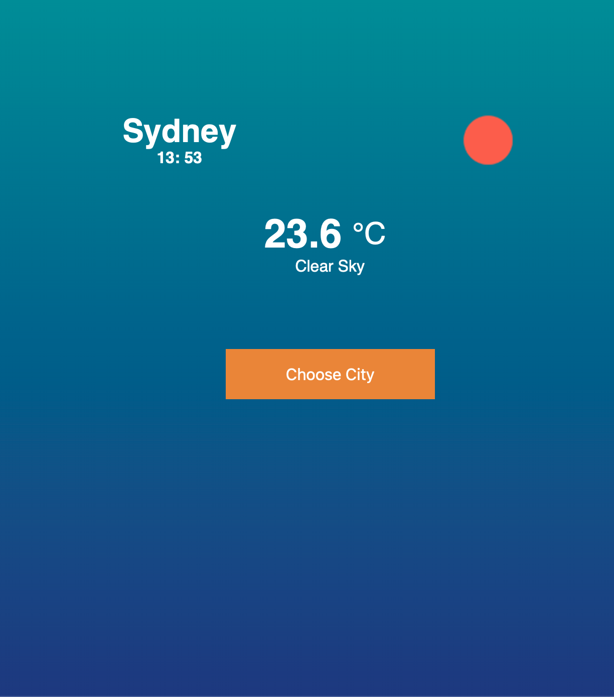
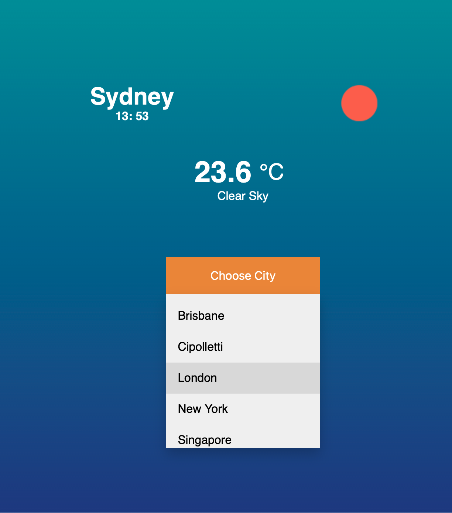

# WeatherApp
Simple application to show the weather of different locations.<br>
<br>
<br>



### Configs
Create file ```env.js``` under "scripts" folder.
```
define([], function(){
    return {
        api_key: <your_api_key>
    };
});
```

### To run app:
Open the ```index.html``` file, and the app will start running in a the browser.
